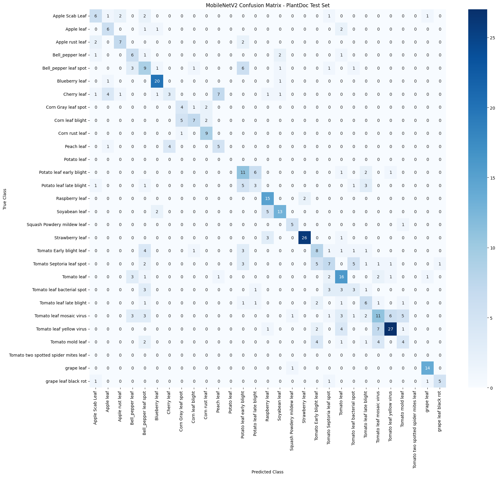
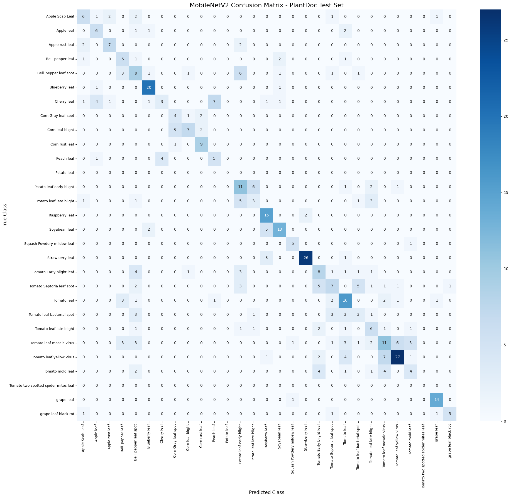
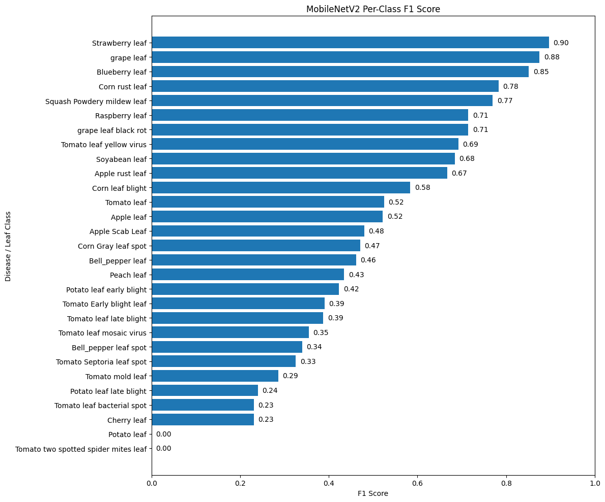
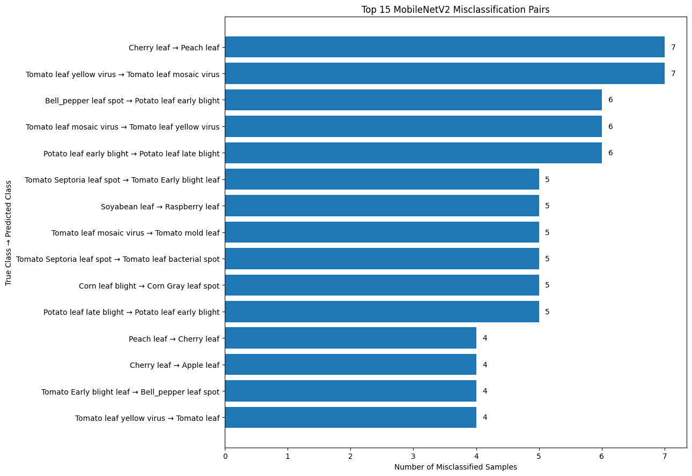
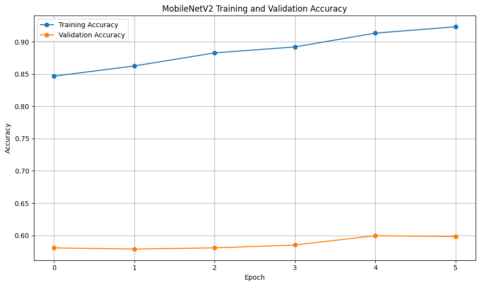
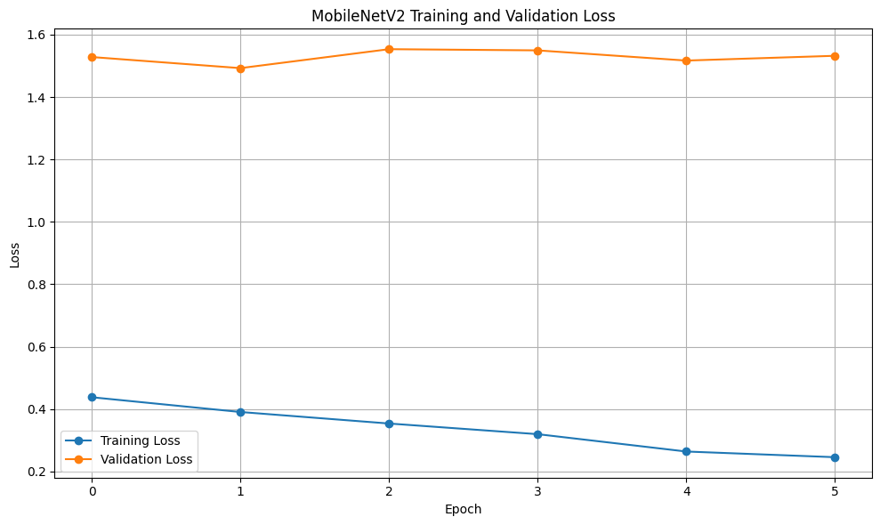
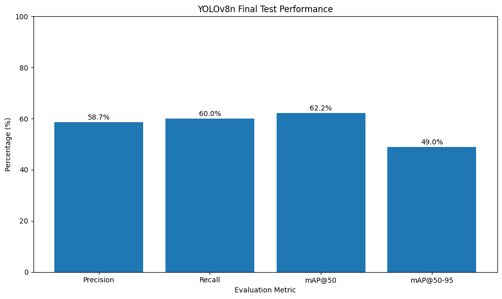

# AI-Based Crop Disease Detection Using Deep Learning

An experimental deep learning project for crop disease classification and object detection using **MobileNetV2, YOLOv8n, and the PlantDoc dataset**.

## Project Overview

Agriculture plays a vital role in food security and economic development. Plant diseases can affect crop quality and productivity, making early identification important for agricultural monitoring.

This project explores an AI-based crop disease identification system using Computer Vision and Deep Learning. It combines two approaches:

- **MobileNetV2:** Classifies crop disease categories from plant leaf images.
- **YOLOv8n:** Detects and localizes disease-related objects using bounding boxes.

The models were trained and evaluated using the PlantDoc dataset, which contains real-world plant images representing multiple disease and leaf categories.

The project focuses on model development, experimental evaluation, classification error analysis, and visualization of results.

## Project Objectives

- Develop a crop disease classification model using MobileNetV2.
- Implement object detection and localization using YOLOv8n.
- Apply transfer learning for image classification.
- Prepare dataset annotations for object detection.
- Evaluate model performance using appropriate metrics.
- Analyze class-wise performance and classification errors.
- Explore the potential of AI-assisted crop disease identification.

## Technologies and Tools

| Category | Technologies |
|---|---|
| Programming Language | Python |
| Deep Learning | TensorFlow, Keras, PyTorch |
| Classification Model | MobileNetV2 |
| Object Detection Model | YOLOv8n |
| Image Processing | OpenCV |
| Data Processing | NumPy, Pandas |
| Visualization | Matplotlib |
| Evaluation | Scikit-learn |
| Development Environment | Google Colab |
| Dataset | PlantDoc |

## Dataset

**Dataset:** PlantDoc Object Detection Dataset

The PlantDoc dataset was used for crop disease classification and object detection experiments.

### Dataset Characteristics

- 29 disease and leaf categories used in the experiments.
- Real-world plant images.
- XML bounding-box annotations.
- Object detection annotations converted into YOLO format.
- Bounding-box crops prepared for classification.
- Training, validation, and testing subsets.

The dataset was organized and preprocessed separately for the classification and detection tasks.

## Proposed System Architecture

```text
                 Plant Leaf Image
                        |
                        v
               Image Preprocessing
                        |
                 +------+------+
                 |             |
                 v             v
             MobileNetV2     YOLOv8n
                 |             |
                 v             v
           Disease Class   Disease Detection
           Probabilities   and Bounding Boxes
                 |             |
                 v             v
            Classification  Localization
                 |             |
                 +------+------+
                        |
                        v
                 Evaluation Results
                        |
                        v
               Performance Analysis
```

## Methodology

### 1. Data Preprocessing

The PlantDoc dataset was prepared for both classification and object detection.

The preprocessing workflow included:

- Image loading and organization.
- Image resizing and normalization for classification.
- Preparation of bounding-box crops.
- Conversion of XML annotations into YOLO-compatible labels.
- Separation of data into training, validation, and testing sets.

### 2. MobileNetV2 – Crop Disease Classification

MobileNetV2 was implemented using transfer learning with ImageNet pretrained weights.

The model was adapted to classify 29 output categories.

#### Model Configuration

| Parameter | Configuration |
|---|---|
| Architecture | MobileNetV2 |
| Pretrained Weights | ImageNet |
| Input Size | 224 × 224 |
| Output Classes | 29 |
| Pooling | Global Average Pooling |
| Dropout | 0.3 |
| Output Activation | Softmax |
| Optimizer | Adam |
| Training Approach | Transfer Learning and Fine-Tuning |

The classification model predicts disease category probabilities for the input plant image.

### 3. YOLOv8n – Crop Disease Detection

YOLOv8n was used to detect and localize plant disease categories using bounding-box annotations.

#### Training Configuration

| Parameter | Configuration |
|---|---|
| Model | YOLOv8n |
| Image Size | 640 × 640 |
| Maximum Epochs | 50 |
| Batch Size | 16 |
| GPU | NVIDIA Tesla T4 |
| Early Stopping | Enabled |
| Task | Object Detection |

The detector produces predicted bounding boxes, class labels, and confidence scores.

## Experimental Results

The following values represent the results obtained in the project's experiments.

### MobileNetV2 Classification Results

| Evaluation Metric | Result |
|---|---:|
| Test Accuracy | 53.78% |
| Weighted Precision | 54.17% |
| Weighted Recall | 53.78% |
| Weighted F1-Score | 53.01% |
| Macro F1-Score | 49.42% |
| Test Samples | 476 |
| Number of Classes | 29 |

### YOLOv8n Object Detection Results

| Evaluation Metric | Result |
|---|---:|
| Precision | 58.7% |
| Recall | 60.0% |
| mAP@50 | 62.2% |
| mAP@50–95 | 49.0% |
| Test Images | 236 |
| Test Instances | 452 |

### Model Comparison

| Model | Task | Reported Test Performance |
|---|---|---|
| MobileNetV2 | Disease Classification | 53.78% Accuracy |
| YOLOv8n | Object Detection | 62.2% mAP@50 |

**Note:** Classification accuracy and object detection mAP are different evaluation metrics and should not be interpreted as directly equivalent measures.

## Results and Evaluation Visualizations

The repository includes evaluation graphs and analysis files generated from the project's experimental results.

### MobileNetV2 Classification

#### Confusion Matrix



#### Detailed Confusion Matrix



#### Per-Class F1 Score



#### Top 15 Misclassifications



#### Training and Validation Accuracy



#### Training and Validation Loss



### YOLOv8n Object Detection

#### Final Test Performance



## Project Files

| File | Description |
|---|---|
| `Crop_Monitoring_and_Disease_Detection.ipynb` | Project notebook containing implementation and experimental work |
| `Recovered_Project_Results.xlsx` | Evaluation workbook containing model comparison and analysis |
| `RECOVERY_NOTE.txt` | Note describing the recovered project results |
| `Recovered_Crop_Disease_Results.zip` | ZIP archive containing recovered evaluation materials |
| `MobileNetV2_Confusion_Matrix.png` | Classification confusion matrix |
| `MobileNetV2_Confusion_Matrix_Detailed.png` | Detailed confusion matrix |
| `MobileNetV2_Per_Class_F1.png` | Class-wise F1-score visualization |
| `MobileNetV2_Top15_Misclassifications.png` | Analysis of the top 15 classification errors |
| `MobileNetV2_Training_Validation_Accuracy.png` | Accuracy curves |
| `MobileNetV2_Training_Validation_Loss.png` | Loss curves |
| `YOLOv8n_Final_Test_Performance.png` | Object detection performance visualization |

## Key Observations

- MobileNetV2 demonstrated the feasibility of transfer learning for crop disease classification.
- YOLOv8n produced object detection results using bounding-box annotations.
- Class-wise evaluation and confusion matrix analysis help identify categories with classification errors.
- Performance varies across disease categories.
- Further improvements are needed before practical deployment.

## Limitations

- The experiments were conducted using the PlantDoc dataset.
- Classification performance varies across the 29 categories.
- Real-world field conditions may differ from the evaluation dataset.
- The reported results do not establish performance across all crop varieties, environments, or image acquisition conditions.
- Further independent testing is required before agricultural field deployment.

## Future Scope

- Improve classification performance through data augmentation and hyperparameter tuning.
- Address class imbalance and limited samples in rare categories.
- Explore advanced classification and object detection architectures.
- Develop a web-based crop disease prediction interface.
- Integrate confidence-based prediction and result visualization.
- Evaluate the models using additional field-collected plant images.
- Investigate deployment on mobile or edge devices.

## Conclusion

This project demonstrates an experimental approach to crop disease identification using deep learning.

MobileNetV2 was explored for disease classification, while YOLOv8n was used for disease detection and localization. The evaluation results, confusion matrices, training curves, and class-wise analysis provide a basis for understanding model performance and identifying areas for improvement.

The project serves as a foundation for further research and development in AI-assisted agricultural monitoring.

## Author

**Sai Teja**  
B.Tech – Electrical and Electronics Engineering

GitHub: [Saiteja1416](https://github.com/Saiteja1416)

## Repository

[AI-Based Crop Disease Detection – GitHub Repository](https://github.com/Saiteja1416/AI-Based-Crop-Disease-Detection)
